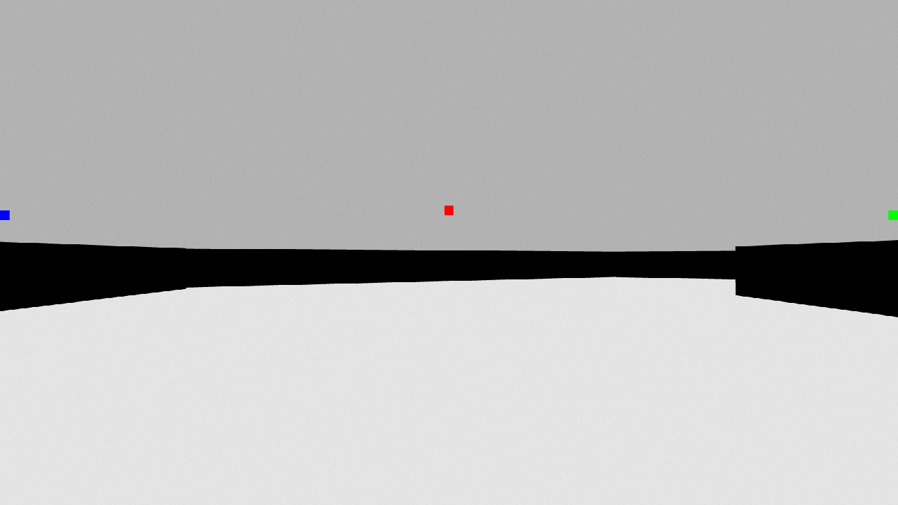

# AutonomousVehicle

## Project description
The goal of this project was to create a track made up of short walls, and have a TurtleBot3 complete laps around the track using only a single camera based navigation system.

The software used for this project:
- Ubuntu 24.04
- ROS2 Jazzy
- Gazebo Harmonic
- OpenCV 4.6.0
- TurtleBot3 2.3.3

### How to run
First install TurtleBot3 and OpenCV with APT. 
Open a new terminal, and go the Autonomous vehicle folder. There use command: "colcon build". Then use the command "source install/setup.bash". Then use then command: "ros2 launch my_world_pkg world_with_trutlebot.launch.py". This opens a Gazebo world with the parkour in it. See image. 

Now open a new terminal, and go the Autonomous vehicle folder. Then use the command "source install/setup.bash". Then use the command "ros2 run velocity_control_pkg velocity_control". This will make de robot drive and follow the track.

If you also want to see what the camera sees then do this: Now open a new terminal, and go the Autonomous vehicle folder. Then use the command "source install/setup.bash". Then use the command "ros2 run vision_pkg image_subscriber". Now a new window should open with the camera footage.

### How does the navigation system work
The navigation system works by checking 3 pixels of the camera footage every 60 miliseconds, a center pixel, a left pixel and a right pixel.
The pixels positions can be seen in the image, the red, blue and green dot. 

The background of the track is white and the obstacles are black. So if a pixel value changes from white to black then it means that there is an obstacle in that position. In the following table all the actions with corresponding pixel values can be seen. LP = left pixel, RP = right pixel, CP = center pixel, 0 = no obstacle, 1 = obstacle.

| Action       | LP | CP | RP |
|--------------|----|----|----|
| Forward      | 0  | 0  | 0  |
| Forward      | 1  | 0  | 1  |
| Soft Left    | 0  | 0  | 1  |
| Hard Left    | 0  | 1  | 1  |
| Soft Right   | 1  | 0  | 0  |
| Hard Right   | 1  | 1  | 0  |
| Backward     | 1  | 1  | 1  |
| Backward     | 0  | 1  | 0  |

